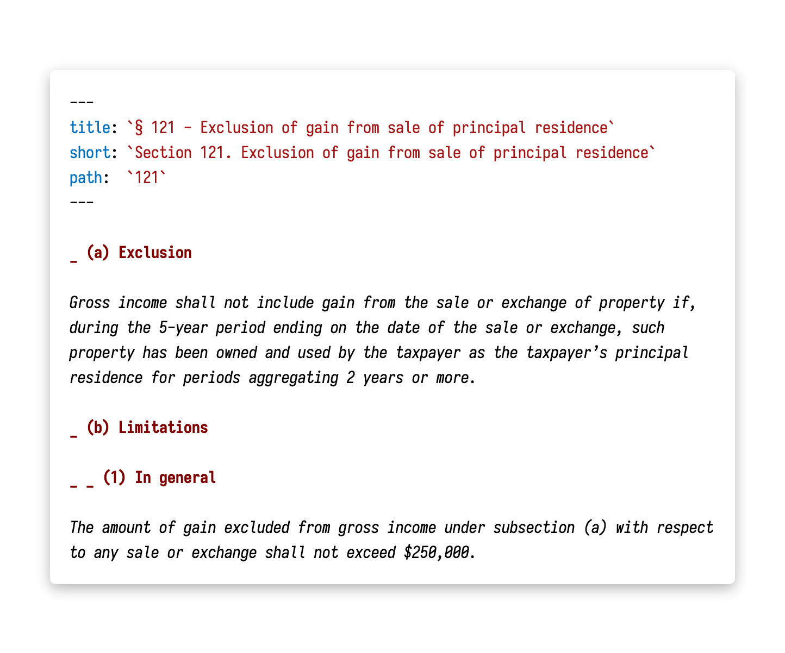
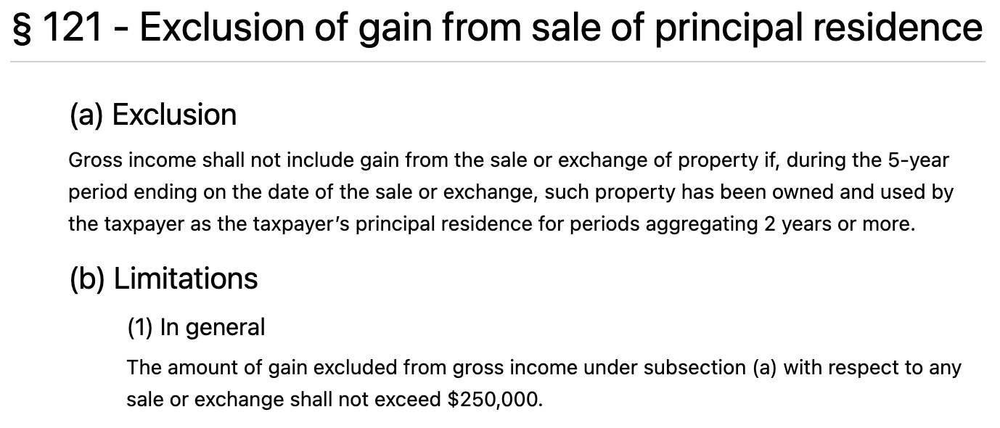
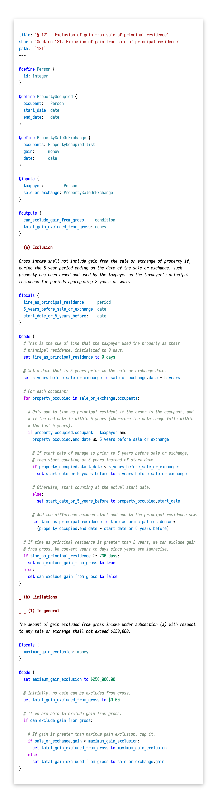
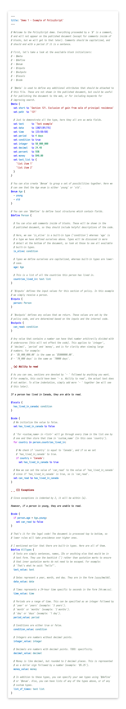

# PolicyScript

A specialized and simple language for defining policy. The goals of PolicyScript:

1. First, to define a markup language that can be used for writing policy text
      - simple syntax for anyone to write
      - generates generic data representations which can be consumed to generate policy documentation
      - describes **content** not **appearance** (think Markdown)
1. Secondly, allow in-line code blocks which define the logic of the policy
      - contains specialized literals to simplify the writing of policy code
      - simple enough to be parsed by non-coders (think Lawyers)

To achieve these goals, the following is, or will be created:

- a fast language parser which will generate both the markup data and the executable logic
- a plugin for VSCode to make developing in PolicyScript enjoyable (see [this repo](https://github.com/policyscript/vscode-policyscript))

## Prior work

- Other projects: [Catala](https://github.com/CatalaLang/catala)
     - When I was searching for existing solutions in this place, Catala was the only complete project I found. I chose to continue with my own project since I think there are still large improvements that could be made in creating a language for policies.
- Research paper: [A Logic for Statutes](https://papers.ssrn.com/sol3/papers.cfm?abstract_id=3088206)
     - A proposal for a formal syntax to define logic for statutes.

## Markup syntax

> For this section and the following code syntax section, I will be recreating a piece of legislature: [26 U.S. Code § 121 - Exclusion of gain from sale of principal residence](https://www.law.cornell.edu/uscode/text/26/121) (up to subsection a, paragraph 1).

Here is the legislature, rewritten in the currently-supported markup:

At the moment it is quite simple, with a YAML-style attribute definition at the top. More features could be added, and it may adopt a very markdown-like style rather than trying to reinvent the wheel. The indentation defined by the `_` character is an attempt to prevent deep nesting to make the document more readable.

This will produce some simple JSON data, which can be interpreted by a site builder to generate something that looks like the following:

However, that will be left up to whatever tooling consumes the raw data from the PolicyScript markup output.

## Code syntax

The code syntax is designed specifically to be easily readable, and to work well for defining policy logic. First, here's a super quick rundown of the syntax:

Anything "code" is wrapped in a block. Blocks start with `@something` and then wrap their contents in `{` and `}`

- `@define` groups together related fields (for example PropertyOccupied contains the occupant, as well as start and end dates)
     - fields consist of a field name (ex: occupant) as well as a type: either a custom defined group type (ex: Person, these will be capitalized) or a built-in type (ex: date, these will be lowercase)
     - field values can be accessed in the code by using "." (ex: if I have a value property_occupied of type PropertyOccupied I can get the start date using property_occupied.start_date)
- `@inputs` defines all of the values that must be input for this law to work (all unknowns, ex we don't know who the taxpayer is or when their property was sold)
- `@outputs` defines all fields that will be set by the legislative code (ex: based on the inputs, we are able to determine the total gain that can be excluded from the gross)
- `@locals` defines any local fields used for the code, but not used outside of this section
- `@code` wraps up all the code logic
- `@meta` meta defines any additional variables used locally to store values
- `@enum` enum defines a variable which can be one of multiple listed values

If we were to add some (well-commented) code to the above markup, it would look something like this (this is a picture since GitHub doesn't support syntax highlighting for `.law` files since they don't exist yet, but the [VSCode plugin](https://github.com/policyscript/vscode-policyscript) does!):

## Full language definition

To see the original code without syntax highlighting, click [here](https://github.com/policyscript/vscode-policyscript/blob/main/examples/demo/demo_1.law).

